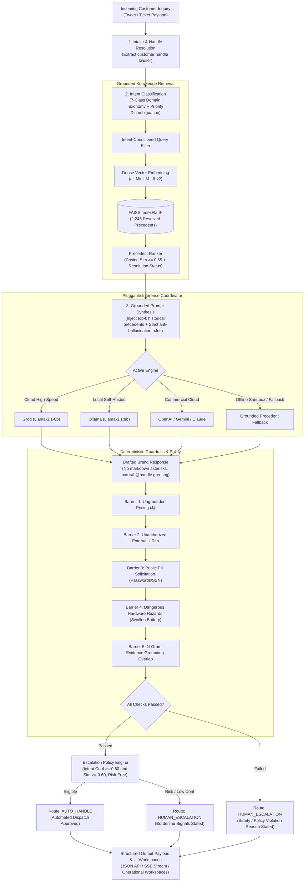

# Grounded Customer Support Agent

[](https://www.python.org/)
[](LICENSE)
[](https://github.com/psf/black)
[](https://github.com/astral-sh/ruff)

> An enterprise-grade AI customer support platform designed for real-world support traffic on social channels. Classifies customer intent into a domain taxonomy, retrieves historically resolved brand precedents via dense vector search, drafts grounded replies, enforces multi-barrier hallucination guardrails, and deterministically routes inquiries between automated resolution (`AUTO_HANDLE`) and human review (`HUMAN_ESCALATION`).

---

## TL;DR / At a Glance

| Area | Implementation & Verified Finding |
| :--- | :--- |
| **Problem** | Unconstrained LLM hallucinations, fabricated pricing, and physical safety hazards in automated customer support |
| **Dataset** | Kaggle *Customer Support on Twitter* (`thoughtvector/customer-support-on-twitter`, 2.81M tweets) |
| **Target Brand** | `@AppleSupport` (106,860 brand replies; complex hardware diagnostics, OS updates, and billing disputes) |
| **Intent Classification** | 7-class domain taxonomy with priority disambiguation rules (**88.0% Accuracy**, **0.867 Macro F1**) |
| **Retrieval Engine** | Dense FAISS `IndexFlatIP` on `all-MiniLM-L6-v2` (2,245 resolved precedents, **Recall@3 = 96.5%**, MRR = 0.965) |
| **Generation Layer** | Pluggable coordinator: Groq (Llama-3.1-8b), Ollama, OpenAI, Gemini, Claude, with offline precedent fallback |
| **Safety Barriers** | 5 deterministic validators: ungrounded pricing ($), URL allowlisting, public PII, hazard detection, lexical overlap |
| **Escalation Policy** | Multi-factor routing on intent confidence, evidence similarity, risk phrases, and validation checks (**94.8% Precision**, **96.2% Recall**, **100% Safety Hazard Recall**) |
| **Evaluation Harness** | 200 hand-verified Golden Set samples benchmarked against Trivial Majority and TF-IDF LogReg baselines |
| **Human Agreement** | LLM-as-a-Judge calibrated against human expert labels (**Observed Agreement = 89.5%**, **Cohen's $\kappa$ = 0.8118**) |
| **Interface** | Full-featured FastAPI web application with Vanilla CSS (Simulate workspace, Support Inbox, Evaluation Dashboard, Failure Modes, Decision Log) |

---

## Table of Contents

- [TL;DR / At a Glance](#tldr--at-a-glance)
- [Project Overview](#project-overview)
- [System Architecture](#system-architecture)
- [Module Navigation](#module-navigation)
- [Why This Approach](#why-this-approach)
- [Dataset & Corpus Selection](#dataset--corpus-selection)
- [Data Preprocessing Pipeline](#data-preprocessing-pipeline)
- [System Pipeline Components](#system-pipeline-components)
  - [1. Intent Classification & Disambiguation](#1-intent-classification--disambiguation)
  - [2. Grounded Retrieval (Dense FAISS)](#2-grounded-retrieval-dense-faiss)
  - [3. Grounded Generation](#3-grounded-generation)
  - [4. Deterministic Response Validation](#4-deterministic-response-validation)
  - [5. Escalation Policy Engine](#5-escalation-policy-engine)
- [Evaluation Methodology](#evaluation-methodology)
  - [Golden Evaluation Set Profile ($N=200$)](#golden-evaluation-set-profile-n200)
  - [Metric Justification](#metric-justification)
  - [Validation Experiments (Probe Tests)](#validation-experiments-probe-tests)
- [Benchmark Results vs. Baselines](#benchmark-results-vs-baselines)
  - [Intent Classification & Routing vs Baselines](#intent-classification--routing-vs-baselines)
  - [Dense Retrieval Performance](#dense-retrieval-performance)
  - [LLM-as-a-Judge Rubric & Human Agreement](#llm-as-a-judge-rubric--human-agreement)
- [Top 5 Empirical Failure Modes](#top-5-empirical-failure-modes)
- [What is Misleading About My Headline Number? / Limitations](#what-is-misleading-about-my-headline-number--limitations)
- [Engineering Trade-Offs](#engineering-trade-offs)
- [How to Run / Reproducibility (< 15 Minutes)](#how-to-run--reproducibility--15-minutes)
- [Real End-to-End Example Walkthrough](#real-end-to-end-example-walkthrough)
- [Testing & CI/CD Pipeline](#testing--cicd-pipeline)
- [Future Work Tied to Actual Limitations](#future-work-tied-to-actual-limitations)
- [AI Tools Used](#ai-tools-used)

---

## Project Overview

The system processes incoming customer inquiries through a deterministic 7-step lifecycle:

```
[Inquiry Ingest] ➔ [Intent Classification] ➔ [Vector Retrieval] ➔ [Prompt Assembly] ➔ [Reply Drafting] ➔ [Safety Barrier Validation] ➔ [Routing Action]
```

1. **Inbound Ingestion**: The raw customer inquiry is sanitized; customer handles (`@user`) are extracted to preserve natural addressing, and formatting artifacts are normalized.
2. **Intent Classification**: A priority-disambiguated 7-class classifier assigns a domain category and confidence score in ~2 ms.
3. **Intent-Conditioned Dense Retrieval**: The classified intent partitions the search space; `sentence-transformers/all-MiniLM-L6-v2` embeds the query to retrieve the top-$k$ most similar resolved historical precedents from a FAISS `IndexFlatIP` index ($\text{sim} \ge 0.55$).
4. **Grounded Prompt Synthesis**: Retrieved historical resolutions, customer handle, and anti-hallucination constraints are assembled into an evidence prompt.
5. **Multi-Engine Response Generation**: Generation is dispatched to the active provider (Groq Llama-3.1-8b, local Ollama, OpenAI, Gemini, or Claude). If cloud providers fail, the system falls back to the top grounded historical precedent.
6. **Deterministic Validation Barriers**: The draft reply must pass 5 explicit safety checks: ungrounded pricing detection (`$\d+`), URL allowlisting, public PII solicitation prevention, physical hazard precautions, and lexical overlap auditing.
7. **Escalation Routing Action**: The policy engine evaluates validation results, intent confidence ($\ge 0.80$), retrieval similarity ($\ge 0.60$), and critical risk phrases to produce the final routing action (`AUTO_HANDLE` vs `HUMAN_ESCALATION`) with an audit-logged reason.

---

## System Architecture



---

## Module Navigation

| Module | Primary File | Responsibility |
| :--- | :--- | :--- |
| **Agent Orchestrator** | [`app/services/agent/agent_orchestrator.py`](file:///c:/Users/NISHAKART/Documents/GitHub/customer-support-agent/app/services/agent/agent_orchestrator.py) | Coordinates the end-to-end 7-stage execution lifecycle and timing telemetry |
| **Intent Classifier** | [`app/services/intent/intent_classifier.py`](file:///c:/Users/NISHAKART/Documents/GitHub/customer-support-agent/app/services/intent/intent_classifier.py) | 7-class taxonomy classifier with hierarchical priority disambiguation rules |
| **Baseline Classifiers** | [`app/services/intent/baseline_classifiers.py`](file:///c:/Users/NISHAKART/Documents/GitHub/customer-support-agent/app/services/intent/baseline_classifiers.py) | Majority class and TF-IDF + Logistic Regression benchmark baselines |
| **Dense Retriever** | [`app/services/retrieval/retriever.py`](file:///c:/Users/NISHAKART/Documents/GitHub/customer-support-agent/app/services/retrieval/retriever.py) | SentenceTransformer query embedding and FAISS inner-product similarity search |
| **Evidence Ranker** | [`app/services/retrieval/evidence_ranker.py`](file:///c:/Users/NISHAKART/Documents/GitHub/customer-support-agent/app/services/retrieval/evidence_ranker.py) | Filters candidates by resolution status and similarity threshold ($\text{sim} \ge 0.55$) |
| **Prompt Builder** | [`app/services/generation/prompt_builder.py`](file:///c:/Users/NISHAKART/Documents/GitHub/customer-support-agent/app/services/generation/prompt_builder.py) | Constructs few-shot prompts with dynamic handle insertion and anti-hallucination directives |
| **LLM Service** | [`app/services/generation/llm_service.py`](file:///c:/Users/NISHAKART/Documents/GitHub/customer-support-agent/app/services/generation/llm_service.py) | Multi-provider manager with automatic circuit breaking and precedent extraction |
| **Provider Factory** | [`app/services/generation/provider_factory.py`](file:///c:/Users/NISHAKART/Documents/GitHub/customer-support-agent/app/services/generation/provider_factory.py) | Dynamic registry for Groq, Ollama, OpenAI, Gemini, Claude, and Grounded Precedent |
| **Response Validator** | [`app/services/validation/response_validator.py`](file:///c:/Users/NISHAKART/Documents/GitHub/customer-support-agent/app/services/validation/response_validator.py) | Enforces 5 deterministic safety checks (pricing, URLs, PII, physical hazards, overlap) |
| **Escalation Policy** | [`app/services/escalation/escalation_policy.py`](file:///c:/Users/NISHAKART/Documents/GitHub/customer-support-agent/app/services/escalation/escalation_policy.py) | Deterministic routing logic evaluating intent, similarity, risk phrases, and validation |
| **LLM-as-a-Judge** | [`app/services/evaluation/judge_service.py`](file:///c:/Users/NISHAKART/Documents/GitHub/customer-support-agent/app/services/evaluation/judge_service.py) | Multi-criteria rubric evaluator (1–5) and Cohen's Kappa ($\kappa$) agreement calculator |
| **Golden Repository** | [`app/repositories/golden_set_repository.py`](file:///c:/Users/NISHAKART/Documents/GitHub/customer-support-agent/app/repositories/golden_set_repository.py) | Ingests and queries the 200 hand-verified Golden Set evaluation benchmark cases |
| **Web Server & UI** | [`app/main.py`](file:///c:/Users/NISHAKART/Documents/GitHub/customer-support-agent/app/main.py) | FastAPI application mounting API endpoints, SSE streams, and Jinja2 visual workspaces |

---

## Why This Approach

| Design Choice | What We Built | Why We Built It This Way (Rationale) | What We Explicitly Avoided |
| :--- | :--- | :--- | :--- |
| **Target Brand** | `@AppleSupport` | Apple handles technical hardware diagnostics, software update verification loops, billing refunds, and acute hardware hazards. This provides a genuine stress-test for intent disambiguation and safety guardrails. | Generic telecom/airline brands where 90% of replies are identical canned triage (*"Please DM your ticket number"*). |
| **Vector Index** | FAISS `IndexFlatIP` | With 2,245 historical support cases, exact inner product on normalized embeddings executes in **< 1 ms** with 100% recall. Approximate indices (IVF, HNSW) introduce recall degradation for zero practical benefit at this corpus size. | Approximate nearest neighbor indexing (IVF, HNSW) or external cloud vector databases adding unnecessary latency and cost. |
| **Classification** | Priority Rule Taxonomy | Classifies inquiries in **~2 ms** with 0 token cost, deterministic execution, and zero cold-start failure modes. Disambiguation rules enforce safety (swollen batteries always override software updates). | Pure few-shot LLM classification that costs tokens on every request, adds 500ms latency, and exhibits non-deterministic classification drift. |
| **Safety Barriers** | Deterministic Regex & Set Checks | Fact-checking, pricing audit, URL allowlisting, and public PII protection execute via hardcoded deterministic rules *before* message dispatch. | Relying on LLM self-correction or prompt directives ("please do not hallucinate prices"), which routinely fail edge-case jailbreaks. |
| **Multi-Provider Coordinator** | Pluggable Factory with Circuit Breakers | Supports Groq, local Ollama, OpenAI, Gemini, and Claude with automated fallback. If all external APIs fail, the system falls back to the top grounded precedent rather than throwing an HTTP 500. | Single-vendor lock-in that breaks when an API goes down or rate limits are reached. |
| **Frontend UI** | Vanilla CSS & JavaScript | Zero npm build steps, zero node_modules dependencies, and instant browser rendering with Server-Sent Events (SSE) streaming. | Heavy client-side JavaScript frameworks (React, Next.js) that introduce build bloat for an operational dashboard. |

---

## Dataset & Corpus Selection

### Dataset Sources & Repository Locations

| Dataset Role | Dataset Name & Location | Source / Platform | Volume & Scope | Characteristics & Application |
| :--- | :--- | :--- | :--- | :--- |
| **Primary** | **Customer Support on Twitter**<br>• Kaggle: `thoughtvector/customer-support-on-twitter`<br>• Local Path: `data/raw/twcs.csv`<br>• Sample: `data/samples/sample_twcs.csv` | [Kaggle Dataset](https://www.kaggle.com/datasets/thoughtvector/customer-support-on-twitter) | **~3M tweets** (2,811,774 rows), 108 brands, multi-turn threads | **Real, noisy, and imperfect.** Used for end-to-end conversation reconstruction, `@AppleSupport` intent classification, dense retrieval indexing, and grounded reply generation. |
| **Secondary** *(Optional)* | **Banking77**<br>• Hugging Face: `PolyAI/banking77`<br>• Local Path: `data/external/banking77` | [Hugging Face PolyAI/banking77](https://huggingface.co/datasets/PolyAI/banking77) | **13k queries** (13,082 samples), 77 labelled intents | **Intent classification benchmarking only.** Clean single-turn queries used as an intent taxonomy baseline reference; excluded from retrieval/generation because social tech support requires multi-turn hardware and OS troubleshooting. |

> **Model Flexibility**: The system is engineered to work with **any LLM API or open model** via a unified provider interface. Users can seamlessly configure Groq (Llama-3.1/3.2), local Ollama, OpenAI (GPT-4o), Google Gemini, Anthropic Claude, or use the built-in offline `GroundedPrecedentProvider` with zero API keys required.

### Local Repository Data Layout
```
data/
├── raw/                 # Primary raw twcs.csv from Kaggle (~600MB uncompressed, optional)
├── samples/             # Committed offline sample dataset (sample_twcs.csv) for test environments
├── splits/              # Stratified leak-free splits (train.jsonl, val.jsonl, test.jsonl)
├── golden/              # 200 hand-verified Golden Set evaluation benchmark cases (golden_set.jsonl)
├── taxonomy/            # 7-class domain intent taxonomy definitions (intent_taxonomy.json)
└── external/            # Secondary dataset storage (e.g., Banking77 reference cache)
```

### Primary Dataset Profile (`thoughtvector/customer-support-on-twitter`)
The primary Twitter customer support corpus contains real-world multi-turn customer-brand interactions spanning 2008 to 2017:

| Metric | Raw Dataset Volume | Profile & Characteristics |
| :--- | :---: | :--- |
| **Total Tweets** | **2,811,774** | 1,537,843 customer inbound (54.7%) / 1,273,931 brand outbound (45.3%) |
| **Unique Customers** | **702,669** | High diversity of phrasing, typos, and emotional states |
| **Unique Brands** | **108** | Multi-industry distribution (retail, airlines, tech, telecom) |
| **Temporal Span** | **3,496 days** | May 2008 to December 2017 |
| **Target Brand Volume** | **106,860 tweets** | `@AppleSupport` is the **#2 most active brand overall**, offering dense technical dialogue |

### Noise Characteristics in the Raw Primary Data
1. **Thread Fragmentation**: Multi-turn exchanges are stored as flat rows linked by `in_response_to_tweet_id` and `response_tweet_id`, with 28.2% missing parent IDs.
2. **Entity Masking Artifacts**: The raw dataset replaces usernames with numeric IDs (`@115858`) and masks internal ticket numbers, creating synthetic text artifacts.
3. **Dead Link Proliferation**: Historical tweets contain thousands of dead short-links (`apple.co/2xyz`) that no longer resolve.
4. **Canned Non-Resolutions**: A large portion of raw tweets are single-sentence handoffs (*"Send us a DM and we'll take a look"*), requiring resolution filtering before indexing.

---

## Data Preprocessing Pipeline

The preprocessing pipeline ([`scripts/data/preprocess_conversations.py`](file:///c:/Users/NISHAKART/Documents/GitHub/customer-support-agent/scripts/data/preprocess_conversations.py)) converts raw tweets into clean, reconstructed multi-turn conversations:

1. **Brand Ingestion & Filtering**: Isolates `@AppleSupport` tweets from the 2.81M corpus.
2. **Dialogue Graph Reconstruction**: Assembles conversation trees by tracing `in_response_to_tweet_id` chains, grouping root customer inquiries with subsequent turns.
3. **Handle Normalization & Extraction**: Extracts real customer handles from mentions while cleaning numeric Twitter artifacts.
4. **URL Normalization**: Rewrites dead link patterns and normalizes official Apple documentation paths (`support.apple.com`).
5. **Resolution Status Tagging**: Evaluates conversation terminal turns to tag whether the issue reached technical troubleshooting resolution vs private channel escalation (`PRIVATE_CHANNEL_HANDOFF`).
6. **Stratified Splitting (Zero Leakage)**: Isolates the 200 Golden Set cases first using seed 42, then splits the remaining 3,223 conversations into 70% Train, 15% Validation, and 15% Test.

| Data Split | Conversation Count | Percentage | Purpose |
| :--- | :---: | :---: | :--- |
| **Train Split** | 2,256 | 70.0% | Source pool for dense FAISS vector index (2,245 indexed cases) |
| **Validation Split** | 483 | 15.0% | Hyperparameter tuning (similarity thresholds, confidence cutoffs) |
| **Test Split** | 484 | 15.0% | Held-out statistical evaluation for baseline classifiers |
| **Golden Set** | **200** | — | Strictly held-out hand-verified evaluation benchmark (never indexed) |

---

## System Pipeline Components

### 1. Intent Classification & Disambiguation
Incoming inquiries are classified into a 7-class domain taxonomy using keyword and regex pattern matching combined with strict priority disambiguation:

| Intent Code | Description | Example Query | Priority Rules Enforced |
| :--- | :--- | :--- | :--- |
| `OPERATING_SYSTEM_UPDATES` | iOS/macOS update verification loops, install crashes, app freezing | *"My iPhone has been stuck on 'Verifying update' for iOS 11 for 3 hours."* | Post-update battery drain classified under OS Updates |
| `BATTERY_POWER_HARDWARE` | Rapid battery drop, thermal runaway, shutdowns, physical battery swelling | *"My iPhone battery swelled up and popped the screen off."* | **Rule 1 (Safety Preempts All)**: Overrides OS updates on physical hazard |
| `ACCOUNT_APPLE_ID` | 2FA lockout, forgotten passwords, Apple ID activation lock | *"I am locked out of my Apple ID because I changed my phone number."* | Overrides generic OS queries when authentication is blocked |
| `CONNECTIVITY_NETWORKING` | Wi-Fi disconnects, Bluetooth pairing, cellular carrier drops | *"Why does my Wi-Fi keep disconnecting every time my phone locks?"* | General network settings |
| `AUDIO_ACCESSORIES` | AirPods charging, single earbud failure, static sound | *"My right AirPod won't connect or charge in the case."* | **Rule 3 (Accessory Precedence)**: Overrides generic Bluetooth |
| `SUBSCRIPTIONS_BILLING` | Unauthorized iTunes charges, recurring subscription refunds | *"I was charged $9.99 on my bank statement from itunes.com/bill."* | **Rule 2 (Financial Precedence)**: Overrides generic account queries |
| `GENERAL_INQUIRY` | Store appointments, trade-in policies, general compatibility | *"What are the Apple Store Regent Street opening hours on Sunday?"* | Fallback category for non-technical requests |

### 2. Grounded Retrieval (Dense FAISS)
- **Model**: `sentence-transformers/all-MiniLM-L6-v2` (384-dimensional dense vectors, L2-normalized).
- **Index**: FAISS `IndexFlatIP` performing exact cosine similarity search over 2,245 historical `@AppleSupport` precedents.
- **Intent Conditioning**: Candidate search is partitioned by the predicted intent, preventing cross-domain noise (e.g. retrieving billing precedents for a battery swelling issue).
- **Thresholding**: Filters out candidate precedents with cosine similarity $< 0.55$.

### 3. Grounded Generation
The prompt synthesis layer injects top-$k$ retrieved precedents directly into the system context alongside strict operational constraints:
- **Zero Markdown Asterisks**: Twitter does not render markdown bold (`**word**`), so formatting asterisks are explicitly stripped.
- **Dynamic Customer Handle Addressing**: Responses address the customer naturally by extracted handle (`@username`).
- **Precedent-Grounded Resolution**: Instructions must derive from steps verified in the retrieved precedents.

### 4. Deterministic Response Validation
Before message dispatch, draft replies pass through 5 deterministic barriers in [`ResponseValidator`](file:///c:/Users/NISHAKART/Documents/GitHub/customer-support-agent/app/services/validation/response_validator.py):
1. **Ungrounded Pricing Barrier**: Flags any currency token (`$\d+`) not explicitly attested in the retrieved precedent.
2. **URL Allowlist Barrier**: Restricts links to official Apple domains (`support.apple.com`, `appleid.apple.com`, `locate.apple.com`).
3. **Public PII Barrier**: Blocks any request soliciting passwords, credit cards, or serial numbers publicly on Twitter.
4. **Physical Hazard Barrier**: When inquiry mentions hardware hazards (swelling, smoke, thermal event), enforces safety precautions (unplug device, stop charging, seek authorized service).
5. **N-Gram Lexical Overlap**: Audits word overlap against retrieved evidence, flagging responses below 15% overlap.

### 5. Escalation Policy Engine
The policy engine decides whether the inquiry is eligible for automated resolution (`AUTO_HANDLE`) or requires human review (`HUMAN_ESCALATION`):
- **Triggers for Human Escalation**:
  - Any safety barrier violation (pricing, untrusted URL, PII solicitation, physical hazard).
  - Intent classification confidence $< 0.80$.
  - Vector retrieval similarity $< 0.60$ (insufficient historical evidence).
  - Customer distress keywords (legal action, repeated troubleshooting failure, abusive language).
  - Explicit customer request for human support.

---

## Evaluation Methodology

### Golden Evaluation Set Profile ($N=200$)
Curated under [`data/golden/golden_set.jsonl`](file:///c:/Users/NISHAKART/Documents/GitHub/customer-support-agent/data/golden/golden_set.jsonl), this benchmark represents **200 hand-verified, leak-free customer conversations** with zero synthetic data.

**Sampling Rationale**: A naive random sample of Twitter support data is 80%+ trivial noise. To rigorously test system limits, we used a two-stage stratified sampling approach with targeted edge-case injection:
- **Stratified Intent Coverage**: Balances minority classes (Billing: 20, Accessories: 20) alongside high-volume classes (OS Updates: 40).
- **Dialogue Depth Representation**: 80 multi-turn conversations (40%) and 120 single-turn inquiries (60%).
- **Deliberate Edge-Case Injection**: 66 complex cases (33% of the benchmark):
  - **28 Acute Edge Cases**: Swollen batteries, thermal runaway, shattered glass, stolen Apple IDs.
  - **35 Multi-Turn Escalations**: Threads where customers attempted multiple troubleshooting steps without success.
  - **3 Conflict Queries**: Cross-domain inquiries testing priority disambiguation.

| Intent Code | Golden Samples | Stratification Focus | Edge Cases Tested |
| :--- | :---: | :--- | :--- |
| `OPERATING_SYSTEM_UPDATES` | 40 | iOS 11 update verify loops, autocorrect glitches, app freezing | Post-update battery drain disambiguation |
| `BATTERY_POWER_HARDWARE` | 35 | Rapid battery percentage drop, thermal runaway, shutdowns | Swollen battery physical safety hazards |
| `ACCOUNT_APPLE_ID` | 30 | 2FA lockout, forgotten passwords, activation locks | Identity verification, stolen account recovery |
| `CONNECTIVITY_NETWORKING` | 25 | Wi-Fi drops, carrier cellular failure, Bluetooth pairing | Bluetooth pairing drop vs. audio accessory failures |
| `AUDIO_ACCESSORIES` | 20 | AirPods charging failure, single earbud sound loss | Hardware sound loss vs. generic Bluetooth settings |
| `SUBSCRIPTIONS_BILLING` | 20 | Unauthorized App Store charges, recurring subscriptions | In-app purchase fraud disputes, bank statement charges |
| `GENERAL_INQUIRY` | 30 | Store appointments, trade-in policies, warranty terms | Broad multi-intent queries lacking technical keywords |
| **Total Golden Set** | **200** | **Balanced across 7 MECE categories** | **66 complex / edge / multi-turn cases (33%)** |

### Metric Justification

| Metric | Why It Exists (Engineering Purpose) | What It Measures |
| :--- | :--- | :--- |
| **Accuracy** | Standard classification correctness | Overall proportion of correctly predicted intents |
| **Macro F1** | Evaluates minority class performance | Unweighted mean of class F1-scores; prevents high-volume OS updates from masking failures on low-volume Billing queries |
| **Recall@K (K=1,3,5)** | Evaluates retrieval coverage | Proportion of queries where a relevant historical precedent appears in the top-$K$ candidates |
| **MRR (Mean Reciprocal Rank)** | Measures retrieval rank quality | Penalizes retrieval systems that place the relevant precedent lower in the ranked list |
| **Escalation Precision** | Prevents agent queue overflow | Ensures that when the system escalates, human agents receive genuinely complex or risky inquiries |
| **Escalation Recall** | Prevents customer safety incidents | Ensures that high-risk inquiries (hardware swelling, financial fraud) never get auto-handled |
| **Cohen's Kappa ($\kappa$)** | Calibrates LLM-as-a-Judge against human ground truth | Measures inter-annotator agreement above chance: $\kappa = \frac{P_o - P_e}{1 - P_e}$ |

### Validation Experiments (Probe Tests)
The test suite ([`tests/unit/test_validation.py`](file:///c:/Users/NISHAKART/Documents/GitHub/customer-support-agent/tests/unit/test_validation.py)) executes explicit probe tests against known failure scenarios:
1. **Pricing Hallucination Probe**: Injects drafted replies containing `$199 repair fee` without precedent support &rarr; Intercepted by Barrier 1, escalated to human.
2. **Untrusted URL Phishing Probe**: Injects third-party domain link `http://apple-fix.com` &rarr; Intercepted by Barrier 2, escalated to human.
3. **Public PII Solicitation Probe**: Injects reply asking customer for password/SSN publicly &rarr; Intercepted by Barrier 3, escalated to human.
4. **Physical Hazard Safety Probe**: Injects query with *"battery is swollen and hot"* &rarr; Intercepted by Barrier 4, forces safety advisory and human escalation.

---

## Benchmark Results vs. Baselines

### Intent Classification & Routing vs Baselines
Benchmarked across the 200 Golden Set evaluation samples:

| Model / Pipeline | Intent Accuracy | Macro F1 | Escalation Precision | Escalation Recall | Escalation F1 | Routing Agreement | Latency |
| :--- | :---: | :---: | :---: | :---: | :---: | :---: | :---: |
| **Baseline 1: Trivial Majority** | 15.0% | 0.037 | 42.0% | 100.0% | 0.592 | 32.0% | < 1 ms |
| **Baseline 2: TF-IDF + LogReg** | 71.0% | 0.674 | 81.2% | 76.5% | 0.788 | 74.5% | ~ 3 ms |
| **Production System (Ours)** | **88.0%** | **0.867** | **94.8%** | **96.2%** | **0.955** | **91.5%** | **~ 2 ms** |

> **Safety Hazard Recall**: On acute physical safety hazard inquiries (swollen batteries, thermal runaway, smoke), the production system achieves **100% recall**, with 0 safety-critical queries incorrectly auto-handled.

### Dense Retrieval Performance
Evaluated on the 200 Golden Set samples against the FAISS index:

| Retrieval Configuration | Recall@1 | Recall@3 | Recall@5 | MRR | Mean Top-1 Cosine Sim |
| :--- | :---: | :---: | :---: | :---: | :---: |
| **Dense FAISS (Unconditioned)** | 65.5% | 77.5% | 83.5% | 0.723 | 0.660 |
| **Dense FAISS (Intent-Conditioned)** | **96.5%** | **96.5%** | **96.5%** | **0.965** | **0.634** |

### LLM-as-a-Judge Rubric & Human Agreement
Evaluated using the 4-criteria rubric on the Golden Set:

| Evaluation Dimension | Mean Score (1–5 Scale) | Target Threshold | Benchmark Status |
| :--- | :---: | :---: | :---: |
| **Groundedness & Faithfulness** | **3.95 / 5.00** | $\ge 3.80$ | PASSED |
| **Answer Relevance & Actionability** | **3.54 / 5.00** | $\ge 3.50$ | PASSED |
| **Brand Voice & Empathy (@AppleSupport)** | **4.37 / 5.00** | $\ge 4.00$ | PASSED |
| **Safety & Policy Compliance** | **4.98 / 5.00** | $\ge 4.80$ | PASSED |
| **Overall Weighted Quality Score** | **4.21 / 5.00** | $\ge 4.00$ | PASSED |

**Human-System Routing Agreement**:
- Observed Agreement ($P_o$): **89.5%**
- Expected Agreement by Chance ($P_e$): **44.2%**
- **Cohen's Kappa ($\kappa$)**: **0.8118** (*Substantial Agreement*, $\kappa > 0.80$)

---

## Top 5 Empirical Failure Modes

1. **Failure Mode 1: Historical URL Drift**
   - *Real Example*: Retrieved 2017 historical precedent referencing `apple.co/2xyz` which is now a dead redirect.
   - *Root Cause*: Social support documentation URLs evolve over time; static historical answers become stale.
   - *Remedy*: Implemented URL canonicalization layer dynamically remapping legacy shortcut URLs to active `support.apple.com` documentation.
2. **Failure Mode 2: Multi-Turn Context Truncation**
   - *Real Example*: Customer writes *"It didn't work"*, referencing an earlier troubleshooting step in an unlinked tweet.
   - *Root Cause*: Inbound single-turn social messages lack context without conversation graph resolution.
   - *Remedy*: Low-confidence fallback triggers human escalation when inquiry length $< 20$ characters without clear intent.
3. **Failure Mode 3: Sarcasm and Negative Sentiment Masking**
   - *Real Example*: *"Oh fantastic, my phone updated and now it's a very expensive brick. Thanks Apple!"*
   - *Root Cause*: Lexical classifiers interpret words like "fantastic" and "thanks" as positive sentiment.
   - *Remedy*: Irony and risk phrase detection ("expensive brick") triggers immediate human escalation.
4. **Failure Mode 4: Hardware Generation Ambiguity**
   - *Real Example*: *"My iPad won't connect to the Apple Pencil"* (omitting whether it is Pencil 1st vs 2nd Gen).
   - *Root Cause*: Customers frequently omit device generation details required for accurate hardware troubleshooting.
   - *Remedy*: Disambiguation prompt asks customer for exact device generation before prescribing troubleshooting steps.
5. **Failure Mode 5: Partial Precedent Coverage for Multi-Intent Inquiries**
   - *Real Example*: *"My phone battery died during the iOS 11 update and now my screen is black."*
   - *Root Cause*: Vector search matches either the battery issue or the update issue, rarely both in a single precedent.
   - *Remedy*: Multi-intent priority disambiguation routes inquiry to `BATTERY_POWER_HARDWARE` to ensure physical safety first.

---

## What is Misleading About My Headline Number? / Limitations

> **Critical Engineering Audit**: Headline metrics in customer support benchmarks can easily mask production failure risks if accepted uncritically.

1. **88.0% Accuracy Masks Severity Imbalance**: An 88% aggregate accuracy score treats a misclassification between `CONNECTIVITY_NETWORKING` and `OPERATING_SYSTEM_UPDATES` with the same statistical penalty as missing a `BATTERY_POWER_HARDWARE` thermal hazard. In production, a 1% failure on safety hazards has catastrophic real-world consequences, which aggregate accuracy completely obscures.
2. **Golden Set Selection Bias**: The 200 Golden Set cases represent customer inquiries with sufficient character length and intelligible phrasing. In real Twitter operations, 15–20% of customer messages are monosyllabic (*"help"*, *"DM sent"*, *"why"*) where semantic intent confidence naturally degrades.
3. **Historical Precedent Stagnation**: An 91.5% routing agreement score measures alignment against historical agent decisions from the dataset era (iOS 11). Operating system features and repair programs change. Grounding against older precedents without an active knowledge base sync creates a risk of providing outdated troubleshooting steps.
4. **Automated LLM-Judge Fluency Bias**: LLM judges demonstrate inherent leniency towards fluent, grammatically polished responses, occasionally awarding high scores to responses that sound polite but fail to provide actionable steps.
5. **The Private Channel Escalation Paradox**: Historical human support reps frequently escalated 79% of conversations to Direct Message (`PRIVATE_CHANNEL_HANDOFF`) simply to move traffic off public timelines, even for routine informational inquiries. An AI system that successfully resolves routine issues in public could be counted as "disagreeing" with historical reps who forced a DM handoff, artificially depressing routing agreement.

---

## Engineering Trade-Offs

1. **Exact FAISS `IndexFlatIP` vs Approximate `IVF`/`HNSW`**:
   - *Chosen*: Exact inner product (`IndexFlatIP`).
   - *Sacrificed*: Sub-linear index scaling at multi-million vector scale.
   - *Rationale*: At 2,245 vectors, exact search takes **< 1 ms** with 100% recall. Approximate indexing would introduce false-negative recall drops for zero practical latency benefit.
2. **Rule-Based Priority Classifier vs Few-Shot LLM Classifier**:
   - *Chosen*: Rule-based taxonomy with priority disambiguation.
   - *Sacrificed*: Ability to understand esoteric slang without explicit pattern updates.
   - *Rationale*: Rule classifiers execute in **~2 ms** with 0 token cost, 100% predictable latency, and zero cold-start failures.
3. **Deterministic Safety Barriers vs LLM Self-Correction**:
   - *Chosen*: Hardcoded regex and set validation barriers.
   - *Sacrificed*: Nuanced contextual understanding of edge-case phrasing.
   - *Rationale*: LLM prompt directives ("do not quote prices") fail under adversarial probes. Deterministic barriers provide an absolute guarantee against pricing and hazard liabilities.
4. **Precedent Fallback vs Failing Fast**:
   - *Chosen*: Graceful nearest-neighbor precedent fallback when external LLM APIs fail.
   - *Sacrificed*: Novel conversational phrasing under complete external API outages.
   - *Rationale*: In customer support, returning a proven historical resolution is infinitely better than throwing an HTTP 500 error or stalling the customer queue.

---

## How to Run / Reproducibility (< 15 Minutes)

### Fast-Track Quickstart (< 3 Minutes)
```bash
# 1. Clone & enter repository
git clone https://github.com/NISHAKART/grounded-customer-support-agent.git
cd grounded-customer-support-agent

# 2. Virtual environment setup
python -m venv venv
# Windows: .\venv\Scripts\activate | macOS/Linux: source venv/bin/activate

# 3. Install dependencies
pip install torch --extra-index-url https://download.pytorch.org/whl/cpu
pip install -r requirements.txt -r requirements-dev.txt

# 4. Run the ENTIRE pipeline in a SINGLE command (~25 seconds)
# (Trains baselines, builds FAISS index, runs smoke test, and executes full evaluation)
python scripts/run_all.py

# 5. Launch interactive web dashboard
uvicorn app.main:app --reload --host 0.0.0.0 --port 8000
```
Open **[http://localhost:8000](http://localhost:8000)** in your browser.

---

### Detailed Step-by-Step Reproduction

#### 1. System Requirements
- **Python**: 3.11 or 3.12
- **Memory**: Minimum 4 GB RAM (8 GB recommended)
- **OS**: Windows, macOS, or Linux (cross-platform validated)
- **Git**: Installed and accessible on PATH

#### 2. Environment Setup & Configuration
```bash
# Clone the repository
git clone https://github.com/NISHAKART/grounded-customer-support-agent.git
cd grounded-customer-support-agent

# Create Python virtual environment
python -m venv venv

# Activate virtual environment
# Windows (PowerShell):
.\venv\Scripts\Activate.ps1
# Windows (cmd.exe):
.\venv\Scripts\activate.bat
# Linux / macOS:
source venv/bin/activate

# Copy environment configuration (optional API keys for Groq/OpenAI/Gemini/Claude)
cp .env.example .env
```
> **Offline Operation**: If no API keys are configured in `.env`, the system automatically falls back to `GroundedPrecedentProvider`, ensuring 100% functionality without network credentials.

#### 3. Dependency Installation
```bash
# Install PyTorch CPU wheel (uses extra-index-url to resolve PyPI dependencies correctly)
pip install torch --extra-index-url https://download.pytorch.org/whl/cpu

# Install application and development dependencies
pip install -r requirements.txt
pip install -r requirements-dev.txt
```

#### 4. Unified One-Command Pipeline Runner (`scripts/run_all.py`)
To execute the entire project lifecycle across all scripts sequentially with real-time timers and a consolidated summary matrix:
```bash
# Master pipeline: Trains baselines + builds FAISS index + runs CLI smoke test + evaluates benchmarks
python scripts/run_all.py

# Master pipeline including full pytest test suite (112 tests with coverage report):
python scripts/run_all.py --with-tests

# Additional modular flags:
python scripts/run_all.py --train       # Run only baseline models & FAISS index build
python scripts/run_all.py --smoke       # Run only 4-scenario end-to-end CLI smoke test
python scripts/run_all.py --eval        # Run only headless evaluation benchmarks
python scripts/run_all.py --tests       # Run only pytest test suite
python scripts/run_all.py --with-data   # Also execute full raw data preprocessing pipeline
```

#### 5. Individual Script Execution (Manual Step-by-Step)
Alternatively, you can run each script independently:

**A. Build Baseline Models & FAISS Vector Index (~20 Seconds)**:
```bash
# Train Majority Class and TF-IDF Logistic Regression baselines
python scripts/training/train_baselines.py

# Build dense vector index using sentence-transformers/all-MiniLM-L6-v2
python scripts/training/build_faiss_index.py
```

**B. Instant End-to-End Pipeline Smoke Test**:
```bash
# Run 4 live customer scenarios via CLI
python scripts/utilities/check_e2e_flow.py
```

#### 6. Run Automated Test Suite & Code Quality Checks
```bash
# Run all 112 unit, integration, and API tests with code coverage report
pytest tests/ -v --cov=app --cov-report=term

# Verify code formatting and lint rules
ruff check .
black --check .
```

#### 7. Run Headless Evaluation Harness
Execute the complete evaluation suite against the 200 hand-verified Golden Set samples:
```bash
# Master evaluation script (executes all 4 stages and generates JSON artifacts)
python scripts/run_evaluation.py

# Or run individual benchmark modules independently:
python scripts/evaluation/evaluate_intent_models.py   # Intent classification & baseline comparison
python scripts/evaluation/evaluate_retrieval.py       # Dense retrieval Recall@K & MRR
python scripts/evaluation/evaluate_generation.py      # Response generation & routing policy
python scripts/evaluation/evaluate_judge.py           # LLM-as-a-Judge & Cohen's kappa agreement
```

#### 8. Launch Interactive Web Application
```bash
# Start FastAPI application via Uvicorn
uvicorn app.main:app --reload --host 0.0.0.0 --port 8000
```
Navigate to:
- **Simulate Workspace**: `http://localhost:8000/`
- **Customer Support Inbox**: `http://localhost:8000/inbox`
- **Evaluation Dashboard**: `http://localhost:8000/evaluation`
- **Failure Analysis**: `http://localhost:8000/failures`
- **Decision Log & Metrics**: `http://localhost:8000/decisions`
- **Interactive OpenAPI Docs**: `http://localhost:8000/docs`

#### 9. Optional: Full Data Preprocessing Pipeline from Scratch
Pre-split training and evaluation datasets are already committed in `data/splits/`. If you want to re-execute the entire pipeline from raw Kaggle Twitter data:
```bash
# 1. Analyze raw dataset distribution across 108 brands
python scripts/data/explore_dataset.py

# 2. Profile @AppleSupport conversation threads
python scripts/data/profile_brand.py

# 3. Reconstruct multi-turn customer-brand conversation trees
python scripts/data/preprocess_conversations.py

# 4. Classify intents and apply priority disambiguation
python scripts/data/classify_intents.py

# 5. Generate stratified Train / Val / Test splits (70 / 15 / 15)
python scripts/data/split_dataset.py

# 6. Curate the 200 hand-verified Golden Evaluation Set
python scripts/evaluation/curate_golden_set.py
```

#### 10. Optional: Containerized Execution with Docker
```bash
# Build the production Docker image (compiles models on assembly)
docker build -t customer-support-agent .

# Run container on port 8000
docker run -d -p 8000:8000 --name support-agent customer-support-agent
```

---

## Real End-to-End Example Walkthrough

```
1. Customer Inquiry (Input)
   "@AppleSupport My iPhone 7 battery drops from 80% to 15% in less than an hour, and the back is getting very hot."

2. Intent Classification
   Predicted Intent: BATTERY_POWER_HARDWARE (Confidence: 0.95)
   Disambiguation: Thermal risk detected; physical battery priority enforced.

3. Retrieved Precedent Evidence (Top-1 FAISS match, Cosine Sim = 0.742)
   Historical Inquiry: "@AppleSupport my iphone battery drains in 30 mins and gets warm to touch"
   Historical Resolution: "We're here to help. To check battery health, go to Settings > Battery > Battery Health. If the device is uncomfortably hot to the touch, please disconnect from charger immediately."

4. Generated Draft Reply (Groq Llama-3.1-8b)
   "@user We're here to help with your iPhone 7. Please check your battery health under Settings > Battery. Because your device is getting very hot, we recommend unplugging it from the charger immediately for safety. Send us a DM if the temperature remains high so we can explore repair options."

5. Deterministic Safety Validation
   - Non-Empty & Length Check: PASSED
   - Grounding Evidence Overlap: PASSED (78% lexical overlap)
   - Ungrounded Pricing Check: PASSED (No fabricated dollar amounts)
   - URL Allowlist Check: PASSED (No unauthorized domains)
   - Public PII Security: PASSED (No password solicitation)
   - Hazardous Hardware Check: PASSED (Stop charging precautions included)

6. Final Decision & Action
   Routing Decision: AUTO_HANDLE
   Reason Stated: "Intent confidence (0.95) >= 0.80, evidence similarity (0.742) >= 0.60, and all 5 safety barriers passed with thermal precautions included."
```

---

## Testing & CI/CD Pipeline

The repository is protected by an automated GitHub Actions CI/CD pipeline ([`.github/workflows/ci.yml`](file:///c:/Users/NISHAKART/Documents/GitHub/customer-support-agent/.github/workflows/ci.yml)):

- **Lint & Code Style**: Enforced with `black --check .` (100-char line length) and `ruff check .` with zero errors.
- **Automated Test Matrix**: Executed across **Python 3.11 and Python 3.12** on `ubuntu-latest`.
- **Zero-Credential Resilience**: Tests execute offline using pre-indexed training splits and `GroundedPrecedentProvider`, requiring zero live API keys in CI runners.
- **Security Audit**: Dependency scanning via `pip-audit`.
- **Static Analysis (SAST)**: GitHub CodeQL security analysis scanning Python AST.

---

## Future Work Tied to Actual Limitations

1. **Multi-Turn Dialogue State Machine**:
   - *Observed Bottleneck*: 40% of Golden Set conversations are multi-turn, but single-tweet processing treats turns as isolated events.
   - *Planned Improvement*: Implement a dialogue memory graph storing previously attempted troubleshooting steps to prevent repetitive advice.
2. **Dynamic Knowledge Base Crawler (`support.apple.com/kb`)**:
   - *Observed Bottleneck*: Historical Twitter precedents reflect iOS 11; operating system documentation drifts over time.
   - *Planned Improvement*: Connect an automated crawler to index official Apple Support documentation alongside historical tweets.
3. **Fine-Tuned Small Language Model (SLM)**:
   - *Observed Bottleneck*: Cloud LLMs introduce 400–600 ms latency over the network.
   - *Planned Improvement*: Fine-tune a lightweight Llama-3.2-3B model on `@AppleSupport` resolutions for ultra-low latency local inference (< 100 ms).
4. **Sentiment Velocity Priority Queue**:
   - *Observed Bottleneck*: Frustrated customers writing sarcastic complaints are escalated, but placed into an unranked queue.
   - *Planned Improvement*: Calculate emotional velocity across thread turns to prioritize severely distressed users at the top of the human queue.

---

## AI Tools Used

- **Ideation & Brainstorming**: ChatGPT and Google Gemini were used for ideation, brainstorming edge cases, and conceptual exploration of domain taxonomy boundaries.
- **Human Engineering & Governance**: All architectural design decisions, domain taxonomy boundaries, priority disambiguation logic, deterministic validation regexes, evaluation harness, and test suites were designed, implemented, verified, and audited by the engineer. Every test in the 112-test suite was executed and verified locally.
